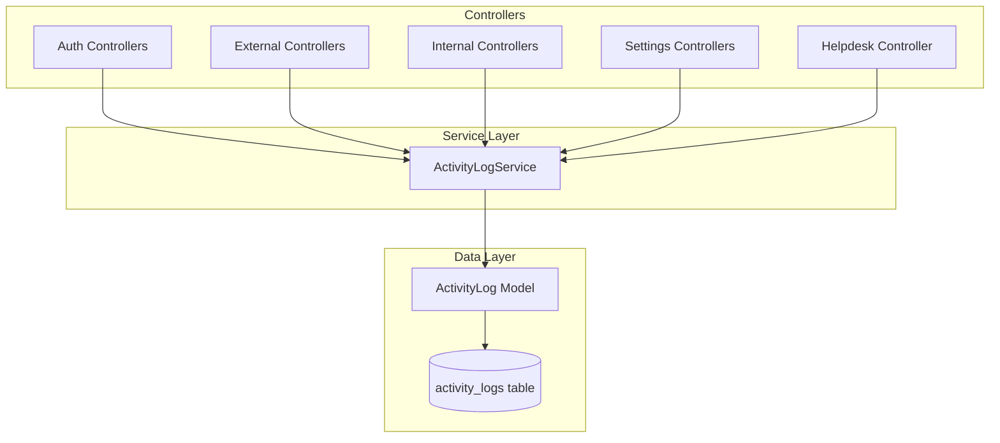

# Design Document: Comprehensive Activity Logging

## Overview

This design extends the existing `ActivityLogService` to provide comprehensive activity logging across all modules in the system. The implementation will integrate logging calls into all controllers that perform CRUD operations, authentication events, and data exports.

The existing infrastructure (`ActivityLog` model, `ActivityLogService`, and `activity_logs` table) provides a solid foundation. This design focuses on integrating logging calls throughout the application.

## Architecture



## Components and Interfaces

### ActivityLogService (Enhanced)

The existing service will be enhanced with additional helper methods:

```php
class ActivityLogService
{
    // Existing methods
    public static function log(string $action, string $description, ?string $module, ?Model $subject, ?array $properties): ActivityLog;
    public static function logLogin(): ActivityLog;
    public static function logLogout(): ActivityLog;
    public static function logCreate(Model $model, string $module, ?string $description): ActivityLog;
    public static function logUpdate(Model $model, string $module, array $oldValues, ?string $description): ActivityLog;
    public static function logDelete(Model $model, string $module, ?string $description): ActivityLog;
    public static function logView(Model $model, string $module, ?string $description): ActivityLog;
    public static function logExport(string $module, string $description, ?array $filters): ActivityLog;
    
    // New methods to add
    public static function logDownload(string $module, string $description, ?array $fileDetails): ActivityLog;
    public static function logPasswordChange(): ActivityLog;
    public static function log2FAChange(string $action): ActivityLog; // 'enabled' or 'disabled'
    public static function logFailedLogin(string $email): ActivityLog;
    public static function logReply(Model $ticket, string $description): ActivityLog;
    public static function logMovement(Model $asset, Model $employee, string $action): ActivityLog; // 'checkout' or 'checkin'
    public static function logSettingsUpdate(string $category, array $changes): ActivityLog;
    
    // Helper to sanitize sensitive data
    private static function sanitizeProperties(array $properties): array;
    
    // NEW: Helper to get client_id and employee_id for current user
    private static function getUserContext(): array;
}
```

### Module Constants

Define standard module names for consistency:

```php
// Modules
const MODULE_AUTH = 'auth';
const MODULE_EXTERNAL_INVENTORY = 'external_inventory';
const MODULE_EXTERNAL_PROJECTS = 'external_projects';
const MODULE_EXTERNAL_SETTINGS = 'external_settings';
const MODULE_INTERNAL_INVENTORY = 'internal_inventory';
const MODULE_INTERNAL_EMPLOYEE = 'internal_employee';
const MODULE_INTERNAL_CREDENTIALS = 'internal_credentials';
const MODULE_INTERNAL_DOWNLOADS = 'internal_downloads';
const MODULE_HELPDESK = 'helpdesk';
const MODULE_SETTINGS_USERS = 'settings_users';
const MODULE_SETTINGS_ROLES = 'settings_roles';
const MODULE_SETTINGS_CONFIG = 'settings_config';
const MODULE_SETTINGS_INTEGRATIONS = 'settings_integrations';
```

### Action Constants

```php
// Actions
const ACTION_LOGIN = 'login';
const ACTION_LOGOUT = 'logout';
const ACTION_LOGIN_FAILED = 'login_failed';
const ACTION_PASSWORD_CHANGE = 'password_change';
const ACTION_2FA_ENABLED = '2fa_enabled';
const ACTION_2FA_DISABLED = '2fa_disabled';
const ACTION_CREATE = 'create';
const ACTION_UPDATE = 'update';
const ACTION_DELETE = 'delete';
const ACTION_VIEW = 'view';
const ACTION_EXPORT = 'export';
const ACTION_DOWNLOAD = 'download';
const ACTION_REPLY = 'reply';
const ACTION_CHECKOUT = 'checkout';
const ACTION_CHECKIN = 'checkin';
```

## Data Models

### ActivityLog Model (Enhanced)

```php
// Enhanced structure with client_id and employee_id
protected $fillable = [
    'user_id',
    'client_id',      // NEW: Direct reference to client
    'employee_id',    // NEW: Direct reference to employee/staff
    'action',
    'module',
    'subject_type',
    'subject_id',
    'description',
    'properties',
    'ip_address',
    'user_agent',
];

protected $casts = [
    'properties' => 'array',
];

// NEW: Relationships
public function client(): BelongsTo
{
    return $this->belongsTo(Client::class);
}

public function employee(): BelongsTo
{
    return $this->belongsTo(Employee::class);
}

// NEW: Helper to determine user type
public function getUserTypeAttribute(): string
{
    if ($this->client_id) return 'client';
    if ($this->employee_id) return 'staff';
    return 'system';
}
```

### Database Migration (New)

```php
// Migration to add client_id and employee_id to activity_logs
Schema::table('activity_logs', function (Blueprint $table) {
    $table->foreignId('client_id')->nullable()->after('user_id')->constrained()->nullOnDelete();
    $table->foreignId('employee_id')->nullable()->after('client_id')->constrained()->nullOnDelete();
    
    $table->index(['client_id', 'created_at']);
    $table->index(['employee_id', 'created_at']);
});
```

### Sensitive Data Patterns to Exclude

```php
private static $sensitiveKeys = [
    'password',
    'password_confirmation',
    'current_password',
    'new_password',
    'api_key',
    'api_secret',
    'secret_key',
    'access_key',
    'two_factor_secret',
    'two_factor_recovery_codes',
    'encrypted_password',
    'encrypted_username',
    'smtp_password',
    'r2_secret_access_key',
];
```

## Correctness Properties

*A property is a characteristic or behavior that should hold true across all valid executions of a system-essentially, a formal statement about what the system should do. Properties serve as the bridge between human-readable specifications and machine-verifiable correctness guarantees.*

### Property 1: CRUD Operations Create Activity Logs

*For any* CRUD operation (create, update, delete) on any loggable model, the system SHALL create exactly one activity log record with the correct action type, module, and subject reference.

**Validates: Requirements 2.1, 2.2, 2.3, 3.1, 3.2, 3.3, 4.1, 4.2, 4.3, 5.1, 5.2, 5.3, 6.1, 6.2, 6.3, 7.1, 7.2, 7.5, 8.1, 8.2, 8.3, 9.1, 9.2, 9.3, 10.3**

### Property 2: View Operations Create Activity Logs

*For any* view operation on a detail page, the system SHALL create exactly one activity log record with action 'view' and the correct subject reference.

**Validates: Requirements 2.4, 3.4, 4.4, 5.4, 6.4, 7.4, 9.4**

### Property 3: Authentication Events Create Activity Logs

*For any* authentication event (login, logout, failed login, password change, 2FA change), the system SHALL create exactly one activity log record with the correct action type and module 'auth'.

**Validates: Requirements 1.1, 1.2, 1.3, 1.4, 1.5**

### Property 4: Export and Download Operations Create Activity Logs

*For any* export or download operation, the system SHALL create exactly one activity log record with action 'export' or 'download' and include relevant filter criteria or file details in properties.

**Validates: Requirements 2.5, 6.5, 11.1, 11.2, 11.3**

### Property 5: Activity Logs Capture Required Metadata

*For any* activity log record created, the record SHALL contain a non-null IP address and user agent string.

**Validates: Requirements 12.1, 12.2**

### Property 6: Sensitive Data Exclusion

*For any* activity log record, the properties field SHALL NOT contain any values for sensitive keys (password, api_key, secret_key, two_factor_secret, etc.).

**Validates: Requirements 4.1, 4.2, 9.1, 10.2, 12.5**

### Property 7: Update Operations Capture Old and New Values

*For any* update operation that creates an activity log, the properties field SHALL contain both 'old' and 'new' keys with the changed values.

**Validates: Requirements 2.2, 3.2, 4.2, 5.2, 6.2, 7.2, 8.2, 10.1, 10.2**

### Property 8: Activity Logs Persist After User Deletion

*For any* user that is deleted, all activity log records created by that user SHALL remain in the database with user_id set to null.

**Validates: Requirements 12.4**

### Property 9: Client and Staff Auto-Detection

*For any* activity log created by a user linked to a client, the client_id field SHALL be automatically populated with the correct client identifier.

**Validates: Requirements 13.1, 13.3**

### Property 10: Staff Identification

*For any* activity log created by a user linked to an employee, the employee_id field SHALL be automatically populated with the correct employee identifier.

**Validates: Requirements 13.2, 13.4**

## Error Handling

1. **Logging Failures**: Activity logging should never cause the main operation to fail. Wrap logging calls in try-catch blocks.

```php
try {
    ActivityLogService::logCreate($model, $module);
} catch (\Exception $e) {
    \Log::error('Activity logging failed: ' . $e->getMessage());
}
```

2. **Missing User Context**: For operations that may occur without authentication (e.g., system jobs), allow null user_id.

3. **Large Properties**: Truncate or summarize large data sets in properties to prevent database bloat.

## Testing Strategy

### Unit Tests

Unit tests will verify individual service methods work correctly:

- Test `logCreate` creates correct log entry
- Test `logUpdate` captures old and new values
- Test `logDelete` captures model attributes before deletion
- Test `sanitizeProperties` removes sensitive keys
- Test logging with null user context

### Property-Based Tests

Property-based tests will verify the correctness properties using PHPUnit with data providers:

1. **CRUD Logging Property Test**: Generate random models, perform CRUD operations, verify logs exist with correct data
2. **Sensitive Data Exclusion Test**: Generate properties with sensitive keys, verify they are removed
3. **Metadata Capture Test**: Perform operations, verify IP and user agent are captured
4. **Update Values Test**: Perform updates, verify old/new values are captured

### Integration Tests

Integration tests will verify end-to-end logging through controllers:

- Test login creates activity log
- Test asset creation creates activity log
- Test export creates activity log with filters

### Test Configuration

- Use PHPUnit for all tests
- Property tests should run minimum 100 iterations with different inputs
- Use database transactions for test isolation
- Mock Request facade for IP/user agent in unit tests
