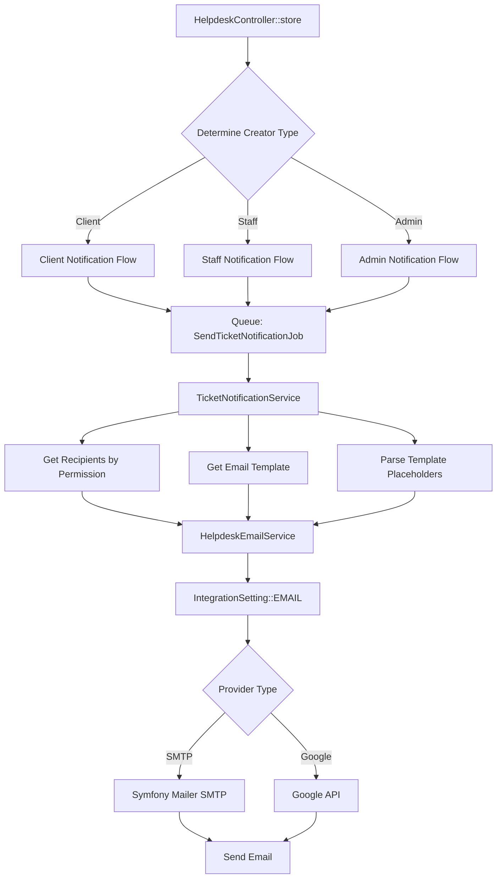

# Design Document: Helpdesk Email Notification Integration

## Overview

Sistem ini mengintegrasikan email templates helpdesk dengan email provider settings untuk menghantar notifikasi automatik apabila ticket baru dicipta. Sistem akan menentukan penerima berdasarkan jenis pengguna yang mencipta ticket (Client, Staff, atau Admin) dan role permissions.

### Key Design Decisions

1. **Queue-based Email Sending**: Semua email dihantar melalui Laravel Queue untuk mengelakkan delay pada ticket creation
2. **Permission-based Recipients**: Penerima ditentukan berdasarkan `helpdesk_tickets.view` permission dalam role matrix
3. **Centralized Email Service**: Satu service class untuk handle semua email operations menggunakan configured provider
4. **Template-based Content**: Guna existing email templates dari `ticket_email_templates` table

## Architecture



## Components and Interfaces

### 1. HelpdeskEmailService

Service class untuk menghantar email menggunakan configured provider.

```php
<?php

namespace App\Services;

class HelpdeskEmailService
{
    /**
     * Send email using configured provider
     * 
     * @param string $to Recipient email address
     * @param string $toName Recipient name
     * @param string $subject Email subject
     * @param string $htmlContent HTML email content
     * @return bool Success status
     */
    public function send(string $to, string $toName, string $subject, string $htmlContent): bool;
    
    /**
     * Check if email service is configured and active
     * 
     * @return bool
     */
    public function isConfigured(): bool;
    
    /**
     * Get email configuration from IntegrationSetting
     * 
     * @return array|null
     */
    public function getConfig(): ?array;
}
```

### 2. TicketNotificationService

Service class untuk menguruskan ticket notifications.

```php
<?php

namespace App\Services;

class TicketNotificationService
{
    /**
     * Send notifications for new ticket
     * 
     * @param Ticket $ticket The created ticket
     * @param User $creator The user who created the ticket
     * @param string $creatorType 'client', 'staff', or 'admin'
     * @return void
     */
    public function sendNewTicketNotifications(Ticket $ticket, User $creator, string $creatorType): void;
    
    /**
     * Get staff users with helpdesk_tickets.view permission
     * 
     * @return Collection<User>
     */
    public function getHelpdeskStaffRecipients(): Collection;
    
    /**
     * Get all staff users (for admin-created tickets)
     * 
     * @return Collection<User>
     */
    public function getAllStaffRecipients(): Collection;
    
    /**
     * Determine creator type based on user
     * 
     * @param User $user
     * @return string 'client', 'staff', or 'admin'
     */
    public function determineCreatorType(User $user): string;
}
```

### 3. SendTicketNotificationJob

Queue job untuk async email sending.

```php
<?php

namespace App\Jobs;

class SendTicketNotificationJob implements ShouldQueue
{
    use Dispatchable, InteractsWithQueue, Queueable, SerializesModels;
    
    public int $tries = 3;
    public array $backoff = [10, 60, 300]; // 10s, 1m, 5m
    
    public function __construct(
        public Ticket $ticket,
        public User $creator,
        public string $creatorType
    ) {}
    
    public function handle(TicketNotificationService $service): void;
    
    public function failed(\Throwable $exception): void;
}
```

## Data Models

### Email Template Data Structure

```php
// Template placeholders mapping
$placeholders = [
    'ticket_number' => $ticket->ticket_number,
    'ticket_subject' => $ticket->subject,
    'ticket_status' => $ticket->ticketStatus?->name ?? $ticket->status,
    'ticket_priority' => $ticket->ticketPriority?->name ?? $ticket->priority,
    'ticket_url' => route('helpdesk.show', $ticket),
    'name' => $recipient->name,
    'first_name' => explode(' ', $recipient->name)[0],
    'site_title' => config('app.name'),
    'site_url' => config('app.url'),
];
```

### Notification Flow Matrix

| Creator Type | Client Receives | Staff (with permission) Receives | Admin Receives | Template Used |
|-------------|-----------------|----------------------------------|----------------|---------------|
| Client | ✅ Confirmation | ✅ Notification | ❌ | `new_ticket_confirmation` (client), `new_ticket_admin` (staff) |
| Staff | ❌ | ✅ Notification | ❌ | `new_ticket_admin` |
| Admin | ❌ | ✅ Notification | ✅ (creator included) | `new_ticket_admin` |

### Recipient Query Logic

```php
// Get users with helpdesk_tickets.view permission
User::whereHas('role', function ($query) {
    $query->where('is_active', true)
          ->whereJsonContains('permissions', 'helpdesk_tickets.view');
})
->where('is_active', true)
->whereNotNull('email')
->where('email', '!=', '')
->get();
```

## Correctness Properties

*A property is a characteristic or behavior that should hold true across all valid executions of a system—essentially, a formal statement about what the system should do. Properties serve as the bridge between human-readable specifications and machine-verifiable correctness guarantees.*

### Property 1: Email Provider Configuration Usage

*For any* email sent through HelpdeskEmailService, the email SHALL use the `from_address` and `from_name` from IntegrationSetting where type is 'email'.

**Validates: Requirements 1.1, 1.4**

### Property 2: Client Ticket Creation - Client Receives Confirmation

*For any* ticket created by a Client_User, the Client_User SHALL receive exactly one email using the `new_ticket_confirmation` template.

**Validates: Requirements 2.1**

### Property 3: Permission-Based Staff Recipient Determination

*For any* ticket notification sent to staff, all recipients SHALL have a role with `helpdesk_tickets.view` permission, be active, and have a valid email address.

**Validates: Requirements 2.2, 3.1, 6.1, 6.2, 6.3**

### Property 4: Staff/Admin Ticket Creation - Client Exclusion

*For any* ticket created by a Staff_User or Admin_User, the associated Client SHALL NOT receive any email notification.

**Validates: Requirements 3.2, 4.2**

### Property 5: Template Selection Correctness

*For any* staff notification email, the template used SHALL be `new_ticket_admin`.

**Validates: Requirements 2.3, 3.4, 4.3**

### Property 6: Template Placeholder Parsing

*For any* email template with placeholders, parsing with ticket data SHALL replace all `{{placeholder}}` patterns with corresponding actual values, and no unresolved placeholders SHALL remain in the output.

**Validates: Requirements 5.1, 5.2, 5.3, 5.4, 5.5, 5.6, 5.7, 5.8, 5.9**

### Property 7: Queue-Based Email Dispatch

*For any* ticket notification, the email sending SHALL be dispatched to queue (not sent synchronously) to ensure ticket creation is not blocked.

**Validates: Requirements 7.1**

## Error Handling

### Email Service Not Configured

```php
if (!$this->emailService->isConfigured()) {
    Log::warning('Helpdesk email notification skipped: Email service not configured', [
        'ticket_id' => $ticket->id,
        'ticket_number' => $ticket->ticket_number,
    ]);
    return;
}
```

### No Recipients Found

```php
if ($recipients->isEmpty()) {
    Log::warning('Helpdesk email notification: No recipients found', [
        'ticket_id' => $ticket->id,
        'creator_type' => $creatorType,
    ]);
    return;
}
```

### Email Send Failure

```php
try {
    $this->emailService->send($to, $toName, $subject, $content);
} catch (\Exception $e) {
    Log::error('Helpdesk email notification failed', [
        'ticket_id' => $ticket->id,
        'recipient' => $to,
        'error' => $e->getMessage(),
    ]);
    // Job will retry based on $tries and $backoff
    throw $e;
}
```

## Testing Strategy

### Unit Tests

1. **HelpdeskEmailService Tests**
   - Test `isConfigured()` returns false when no settings
   - Test `isConfigured()` returns true when properly configured
   - Test `getConfig()` returns correct credentials
   - Test `send()` uses correct from address/name

2. **TicketNotificationService Tests**
   - Test `determineCreatorType()` correctly identifies client/staff/admin
   - Test `getHelpdeskStaffRecipients()` filters by permission
   - Test `getHelpdeskStaffRecipients()` excludes inactive users
   - Test `getHelpdeskStaffRecipients()` excludes users without email

3. **Template Parsing Tests**
   - Test all placeholders are replaced correctly
   - Test missing data doesn't cause errors

### Property-Based Tests

Using PHPUnit with data providers for property testing:

1. **Property 3 Test**: Generate random users with various role permissions, verify only those with `helpdesk_tickets.view` are included in recipients
2. **Property 6 Test**: Generate random ticket data, verify all placeholders are replaced and no `{{...}}` patterns remain

### Integration Tests

1. Test full flow: Client creates ticket → Job dispatched → Emails queued
2. Test full flow: Staff creates ticket → Client NOT notified
3. Test full flow: Admin creates ticket → All staff notified

### Test Configuration

```php
// Minimum 100 iterations for property tests
// Tag format: Feature: helpdesk-email-notification, Property N: description
```
